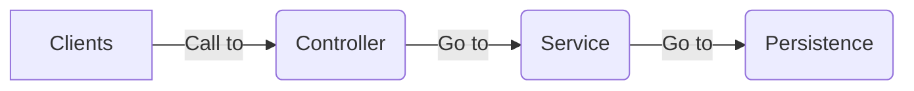

# Spring framework!

Hi! This project is about a  **petshop** website, for now I am deploying the backend in Spring framework while I am learning more about the Spring.

# Structure

```mermaid
graph  LR
A[Clients] -->|Call to| B(Controller)
B --> |Go to|C(Service)
C --> |Go to|D(Persistence)
```

